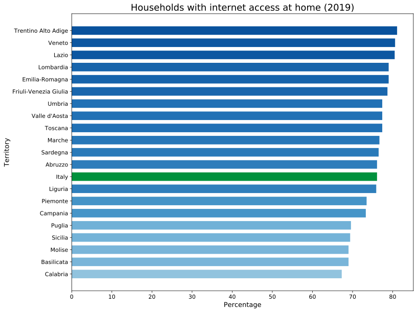
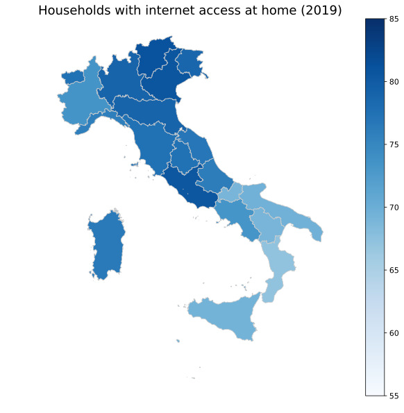
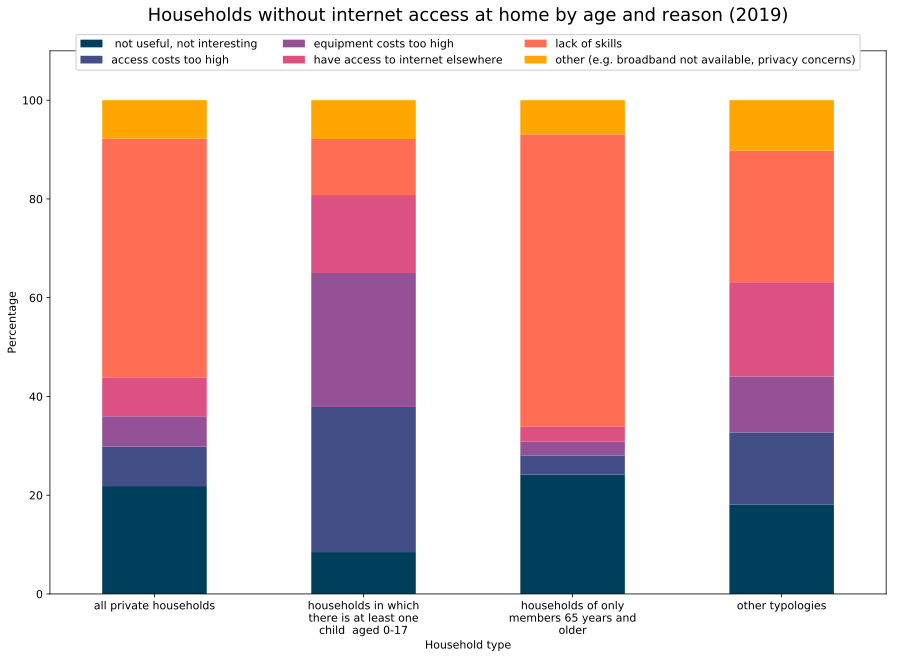

# An analysis of the digital divide in Italy and Europe

## Overview

In a world that is every day more connected, it is crucial to support this change with suitable infrastructure. Moreover, the last months have forced all the countries to face a tough challenge in terms of technological development (and not only that), due to COVID19. Sustaining the digital economy is critical to deal with such extreme scenarios, but also to guarantee a better state of life and to give more opportunities to the people, and thus introducing new lymph in the economy of the country. The digital divide is a phenomenon that affects many nations, with different levels of intensity.

With this project, we aim to carry on a detailed analysis of the current situation in Italy and Europe for what regards the digital society and digital economy aspects. More precisely, the focus will be on Italy itself, performing the first analysis at a regional level, trying to find and show what are the differences among the different regions, and trying to emphasize the imbalances. Then, our magnifying glass will do a step back, to show the differences at a European level. 

### Our datasets
The data we used to perform our analysis came from the ISTAT and Eurostat websites. In particular, we used **I.Stat data warehouse** for Italy, while we used the **Digital Agenda for Europe** for the analysis at a European level.

### Our libraries
Outlined below is a list of the main libraries and tools we used to carry out the analysis:
   - pandas
   - geopandas
   - matplotlib
   - seaborn
   - plotly
   - dash

## Analysis

### Italy

#### 1. Household internet access and sentiment

This section focuses on the disparities in Italian people's approach towards technology, internet and e-commerce, capturing the findings of the most recent survey (2019), as well as the evolution of some parameters across the years.

The data is obtained from the sample survey "Aspects of daily life", which is part of an integrated system of social surveys - The Multipurpose Surveys on Household - and collects fundamental information on individual and household daily life. From 1993 to 2003 the survey was conducted annually, with data collected during the month of November. In 2004 the survey did not take place and, starting from 2005, it was run every year in February.

The survey provides information on the citizens' habits and the problems they face in every day life. The thematic areas are on different social aspects, allowing to assess the quality of individual life: here we specifically focus on the citizens' internet access.

***1.1 Households with internet access at home by region (2019)***

The graph shows the different distribution in household internet access thoroghout the regions: it highlights how the southern regions of the country are (mostly) below average, while the center-northern regions are generally above average, albeit the difference is not extremely pronounced. The bar chart and the choropleth map provide a look at this data from different perspectives.

 

   
   

 

***1.2 Households with internet access at home by age group (2019)***

Together with the geographic imbalance, the age gap is especially pronounced in Italy: it is a country with an older population than most others, and this is reflected in many of the indicators analyzed in this report.

The following chart shows the percentage of households with and without an internet connection, by age group: the most noticeable discrepancy lies in the households with over-65 members, since most (64.7%) of those don't have an internet connection at home.

 

   

 

***1.3 Households without internet access at home by age group and reason (2019)***

The next chart illustrates the previous data in more detail, looking at the same age groups and breaking down the reasons for not having internet at home. In general, the predominant reasons are "lack of skills", and finding the internet "not useful, not interesting", which highlights a widespread disinterest and a  noticeable cultural hindrance to the modernization of the country. These findings are especially evident in the over-65 age group.

 

   

 

#### 2. Household internet and services usage

This section focuses on the citizens that actually use the internet as a tool in their everyday life, initially showing the increment over the years in the different age groups. Then, it deals with two of the most common activities carried out on the web: interaction with the public authorities and online purchases.

***2.1 Internet usage by age over time (2001-2019)***

The chart shows internet usage over the years divided by age group. The "6 years and older" represents the increase in internet usage in the general population. It can be observed that the youngest groups (6-44) follow an increase similar to the general trend (while starting from an higher percentage, as expected); on the other hand, people in the 45-64 range show the most marked increase, indicating that older generations are getting more aquainted with the internet. The significant group of elderly people (65 and older) is lowering the average increase, although a steadier increase can be noticed in recent years (from 2017 onwards).

Focusing on the years 2007-2011 an increase in internet adoption speed can be pointed out: this is likely due to the rapid increase in the spread of smarthphones during that period.

 

   

 

***2.2 Interaction with the public authorities on the internet (2019)***

A necessary step in the simplification of the bureaucracy of a country is the digital transformation of its public services. In Italy, much has been done in the last few years in this regard, but progress has been delayed by the already mentioned cultural resistances to digitalization.

The following chart shows the percentage of individuals aged 14 and over who have interacted with public authorities in the last 12 months (with their specific activity), broken down by macro-areas: it can be observed that the percentages are generally still low all over the country, not ever reaching 30%. Going in more detail, the national differences already found in other indicators are replicated here, with the south showing values around 5% lower than the north and center, on a national scale. In all cases the most frequent interaction is "obtaining information", with "downloading officila forms as a close second: those are more *passive* interaction as opposed to the more *active* "submitting completed forms", which requires an higher level of *computer literacy* to accomplish.

 

   

 

***2.3 Frequency in online purchases by region (2019)***

Shopping has become in recent years one of the main online activities: the following choropleth maps highlight the regions in which this activity is more frequent, broken down by time passed since the last online purchase. From this visalization, it appears that the inhabitants of the northern regions are generally confident in online shopping and do it very frequently; as the focus shifts towards the south, online purchases become more sporadic, showing that the majority of the inhabitant are not interested or are wary of shopping on the internet. This is especially apparent in the Campania and Sicilia regions, which have the highest percentage of inhabitants that have never made an online purchase.

 

   

 

#### 3. Digital services and innovative technologies

The survey covers the universe of enterprises with 10 or more persons employed active, according to the classification of economic activities adopted in Italy (Ateco 2002), in the areas of manufacturing (D), construction (F), wholesale and detail (G), hotels (H), transport, storage and communication (I), real estate activities, renting, research and development (K) and audiovisual (O).

The object of the survey are the equipments of the ICT enterprises. The sampling design used for the survey is stratified random type. Businesses universe were divided into homogeneous layers for level of economic activity, geographical area and number of employees.

***3.1 Enterprises that use paper/e-invoicing (2018)***

The graph represents the percentage of the enterprises that use different types of invoicing. In particular, the different indicators represent:

- Enterprises sending invoices to other enterprises or government with paper sending (Paper sending)
- Enterprises sending invoices to other enterprises or government with sending of electronic Invoice suitable for automated processing (eInvoice automation suitable)
- Enterprises sending invoices to other enterprises or government using electronic invoice not suitable for automated processing (eInvoice automation not suitable)

***3.2 Enterprises and Big Data***

Big Data are certainly one of the main topic of the moment. The possibility to store, organize and process large amount of data is crucial for the technological and economic development of a country.

**3.2.1 Type of data analyzed by enterprises (2018)**

In the following graph, on the y-axis we find the percentages of the data type analyzed, on the total collected data. The percentages are overall low, and anomalous values can be seen in:

- The analysis of data from the social media source is higher in Center than in every other territory;
- The analysis of the data from smart devices or sensors shows a descending trend from North to South.

**3.2.2 Different types of Big Data analysis (2018)**

Here we have on the left the total percentage of enterprises using Big Data analysis, while on the on the choropleth maps on the right, we can see a more detailed version.

Notably, the percentages are overall very low, and they do not exceed the 8% of companies in both North, Center and South.

It's worth to notice, however, the percentages of the enterprises that perform analysis through external providers with respect to the ones performing analysis directly inside the company:

- Internal analysis is clearly preferred;
- The percentages are consistent with the ones of the right most graph.

***3.3 Enterprises and Cloud Computing***

Cloud computing is another sector which has gone through an incredible rise in popularity and adoption in the last years.

**3.3.1 Level of cloud services**

The level of service here indicates the level of the machines/services bought by the enterprise. The higher is the level, the more efficient and more curated is the service.

We can see how the descending trend (from North to South) is present also in this indicator. The proportion between the 3 levels in a single area is essentially constant, showing a preference for medium and high level services.

**3.3.2 Type of cloud services**

The graph below allows to have a more detailed view of how the enterprises decide to invest their money in Cloud Computing.

The proportions among the services remain essentially stable in the different areas and, not surprisingly, the email and storage services are the most requested, while to the computational power is given little consideration in both North and South.

---

#### 4. Enterprises and digitization

The survey covers the universe of enterprises with 10 or more persons employed active, according to the classification of economic activities adopted in Italy (Ateco 2002), in the areas of manufacturing, construction, wholesale and detail, hotels, transport, storage and communication, real estate activities, renting, research and development and audiovisual.

***4.1 Enterprises which had acquired goods/services in technological areas in the previous three years (2017)***

The graph shows two interesting aspects:
- there is not a clear difference between the macro-areas of the Italian territory;
- nevertheless, except for the "IT security area", the percentages show an overall low acquisition of the other services.
  

 

   

 

***4.2 Enterprises indicating the first five technological areas with greater impact on development in the two-year period (2017)***

This graph is a continuation of the previous one and it can be considered as complementary. Also in this case, the differences between macro-areas are not so marked, but equally there are some interesting aspects:
- the percentages of each area are rationally consistent with the ones in the previous graph;
- the values corresponding to the "online sales" and "social media" for the nord-ovest area are moderately smaller with respect to the others. This could indicate that these two aspects have already been considered by the nord-ovest enterprises in the past and thus they did not have a great impact in the years of the survey;
- critically, the percentages corresponding to the "do not know how to respond" are fairly high.

 

   

 

***4.3 The main digitization factors considered important by enterprises (2018)***

This graph follows the same line of the previous one, but with a focus on the so-called "digitization factors", namely those factors deemed important to sustain the development of the productive sector. 

- firstly, it's interesting to note that there are two clear winners in this analysis: the "ultra-broadband" and the "funding and tax incentives" factors. The latter, in particular, reaches a percentage of about 50%, especially in the south of Italy;
- also in this case, the percentages corresponding to the "do not know how to respond" value are fairly high.

 

   

 

#### 5. Enterprises and innovation

The Community Innovation Survey (CIS) was designed to complement the traditional indicators, such as R&D expenditure and patent statistics, in the measurement of innovation. In particular, the CIS provides a sound statistical basis for better understanding the innovation process and its effects on the economy and for monitoring and evaluating the innovation policies of the Member States and the European Union.

***5.1 Enterprises with innovation activities (2016)***

The two choropleth maps below show the number of enterprises with innovation activities by region and the percentage on the total number of enterprises by region respectively. They are complementary visualizations, since even if the first one shows a sharp distinction between the regions, where north and Lombardia in particular are dominant, the second one reveals that if we consider the percentage on the total number of enterprises, the situation is notable uniform. Nevertheless, the difference in quantitative terms is still meaningful.

 

   

 

***5.2 Innovation expenditure by region (2016)***

The last consideration in the previous section is supported by this other graph, in which it is shown how much each region spends in innovation (data of year 2016). Indeed, it essentially traces the graph showing the number of enterprises with innovation activities, with the exception of the Lazio region.

 

   

 

***5.3 Product/process innovation activities and organisation/marketing innovations (2016)***

This other graph ends the analysis on the innovation aspect in Italian enterprises. It takes into consideration the number of product and process innovation activities, thus at a finer-grained level with respect to the previous ones. However, the data are aggregated by macro-areas, as shown in the visualization. Again, it clearly demonstrates the presence of a relatively big gap between northern and southern regions.  

 

   

 

#### 6. ICT of the enterprises

In this section we focused on some specific aspects that are somehow relevant to understand the technological level present in the italian enterprises. 

***6.1 Percentage of enterprises with a website or a homepage (2019)***

As one can see, the percentages are all over the 50%, but there is a clear distinction between northern and center/southern regions.

 

   

 

***6.2 Enterprises connected via fixed broadband - Download speed (2019)***

Visibly, the download speeds in the three different classes are not so different among the different regions, with an interesting exception of the Calabria region. It is also worth to mention that from the graph it can be seen that on average about 50% of the enterprises have a fixed broadband connection with a download speed below 30 Mb/s, showing a clear infrastructural problem.

 

   

 

***6.3 Investment in ICT skilled employees by the enterprise and ICT functions performed by internal/external suppliers (2019)***

The two graphs are complementary: in the choropleth map we can see how most of enterprises prefer to assign ICT functions to external suppliers instead of choosing a private management. Moreover, there is the usual quantitative difference going from northern to southern regions. In the barchart below, instead, we can take a look on how the enterprises invest in their employees' ICT skills. Although the number of companies employing ICT specialists is already higher in the northern regions, it remains even higher than in the other territories also for the personnel hired in the last year and the willingness to invest in strengthening the skills of employees.

### Europe

In this section we are going to expand our view and take a look at the digital society situation in the whole Europe. The goal is to provide an analysis that allows a comparison between the different countries, so that one can understand what are the strengths and the weaknesses of each country.

As mentioned at the beginning, to carry on this analysis we used the data from the Digital Agenda for Europe, thus the focus is on the EU Member States.

#### Digital Economy and Society Index (DESI)

The Digital Economy and Society Index (DESI) is a composite index that summarises relevant indicators on Europe’s digital performance and tracks the evolution of EU Member States in digital competitiveness.

The majority of DESI indicators come from Eurostat, the statistical office of the European Union. Some broadband indicators are collected by the Commission services from the Member States through the Communications Committee. Other indicators, such as some e-government and broadband indicators, are based on data derived from studies prepared for the Commission.

The DESI is composed of five principal policy areas:

1. Connectivity  
   Fixed broadband take-up, fixed broadband coverage, mobile broadband and broadband prices
2. Human capital  
   Internet user skills and advanced skills
3. Use of internet  
   Citizens' use of internet services and online transactions
4. Integration of digital technology  
   Business digitisation and e-commerce
5. Digital public services  
   e-Government

The data is proposed here in two interactive visualizations:

##### Choropleth map
The interactive map allows to choose one of the 5 Dimensions which make up the DESI and to select on a slider the year to visualize the score for said indicator.

The scores go from 0 to 100 and are obtained by weighting a specific set of indicators. The can be visualized by hovering over each country.

[see website](https://digital-divide-italy.herokuapp.com/)

##### Bar chart
[see website](https://digital-divide-italy.herokuapp.com/)

#### Key Indicators

European Commission services selected various indicators, divided into thematic groups, which illustrate some key dimensions of the European information society. These indicators allow a comparison of progress across European countries as well as over time.

The data is proposed here in another interactive visualization:

[see website](https://digital-divide-italy.herokuapp.com/)